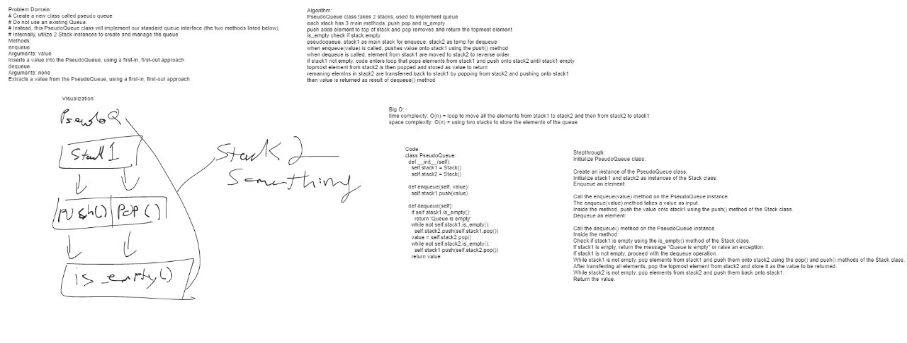

# Challenge 11

Implement a Queue using two Stacks.

## Whiteboard Process

## Approach & Efficiency

## Collaborators

401 Python Classmates

Time: O(1)
Space: O(1)

## Solution

[stack](data_structures/stack_queue_pseudo.py)

