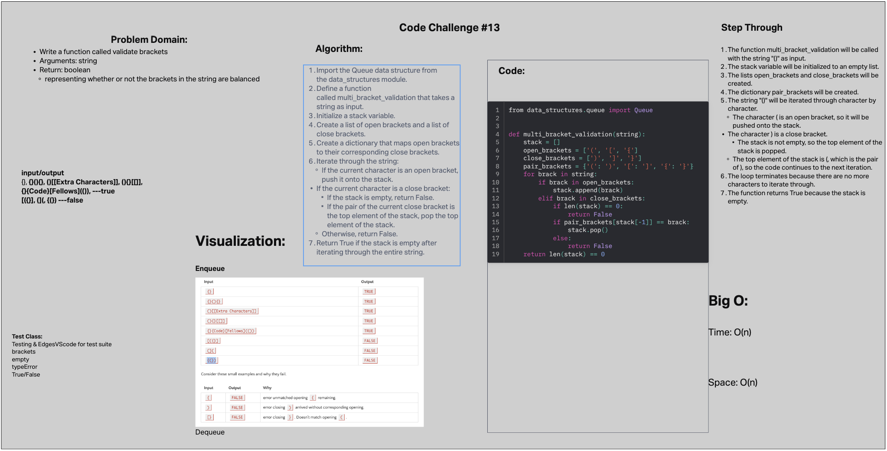

# Challenge 13

Write a function called validate brackets
Arguments: string
Return: boolean
representing whether or not the brackets in the string are balanced

## Authors

Dan Quinn, Andrew Carroll

## Whiteboard Process

## Approach & Efficiency

Time: O(n)
Space: O(n)

## Solution

[stack](data_structures/stack_queue_brackets.py)
