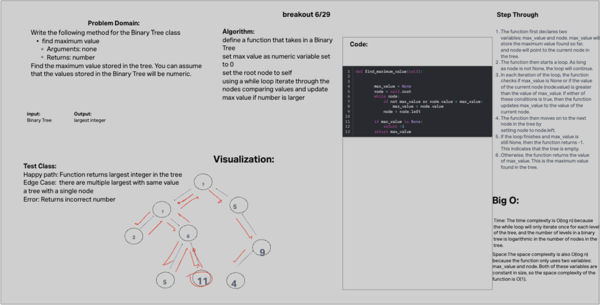

# Challenge 16

## Problem Domain

Write the following method for the Binary Tree class

find maximum value
Arguments: none
Returns: number
Find the maximum value stored in the tree. You can assume that the values stored in the Binary Tree will be numeric.

## Whiteboard Process

## Approach & Efficiency

Time: O(log n)
Space: O(log n)

## Solution

[tree max](data_structures/binary_tree.py)

def find_maximum_value(self):
        # Initialize a variable to store the maximum value.
        max_value = None

        # Set a variable to the root node of the tree.
        node = self.root

        # While the node is not None, do the following:
        while node:

            # If the current value of the node is greater than the current value of the maximum value,
            # update the maximum value.
            if not max_value or node.value > max_value:
                max_value = node.value

            # Set the node to the left child of the current node.
            node = node.left

        # If the maximum value is still None, return -1.
        if max_value is None:
            return -1

        # Otherwise, return the value of the maximum value.
        return max_value
