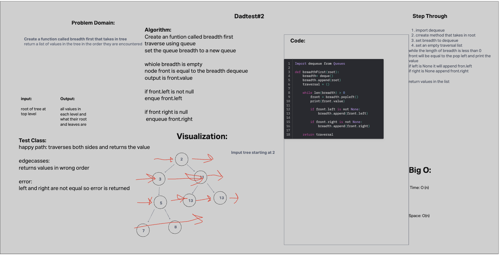

# tree-breadth-first

## Challenge 18

Write a function called breadth first
Arguments: tree
Return: list of all values in the tree, in the order they were encountered

## Collaborators

python 401 class

## Whiteboard Process

## Solution

[tree fizzbuzz](data_structures/tree_breadth_first.py)

def breadth_first(tree):
    if not tree.root:
        return []

    queue = [tree.root]
    values = []

    while queue:
        node = queue.pop(0)
        values.append(node.value)

        if node.left:
            queue.append(node.left)

        if node.right:
            queue.append(node.right)

    return values
