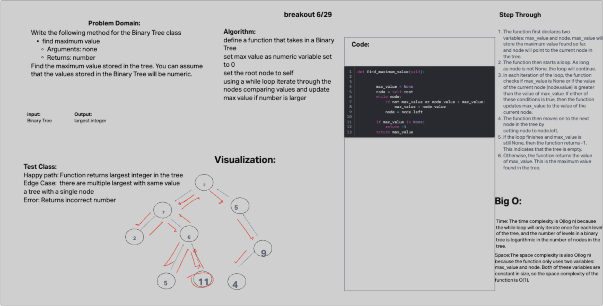

# tree-fizz-buzz

## Challenge 18

Write a function called fizz buzz tree
Arguments: k-ary tree
Return: new k-ary tree
Determine whether or not the value of each node is divisible by 3, 5 or both. Create a new tree with the same structure as the original, but the values modified as follows:

If the value is divisible by 3, replace the value with “Fizz”
If the value is divisible by 5, replace the value with “Buzz”
If the value is divisible by 3 and 5, replace the value with “FizzBuzz”
If the value is not divisible by 3 or 5, simply turn the number into a String.

## Collaborators

python 401 class

## Whiteboard Process

## Solution

[tree fizzbuzz](data_structures/tree_fizz_buzz.py)

class TreeNode:
    def __init__(self, value):
        self.value = value
        self.children = []

def fizz_buzz_tree(tree):
  if not tree:
    return None

  new_tree = KaryTree(TreeNode(None))
  proccess_node(tree.root, new_tree.root)

  return new_tree

def proccess_node(node, new_node):
  if node.value % 15 == 0:
    new_node.value = 'FizzBuzz'
  elif node.value % 5 == 0:
    new_node.value = 'Buzz'
  elif node.value % 3 == 0:
    new_node.value = 'Fizz'
  else:
    new_node.value = str(node.value)

  for child in node.children:
    new_child = TreeNode(None)
    new_node.children.append(new_child)
    proccess_node(child, new_child)

  return new_node
