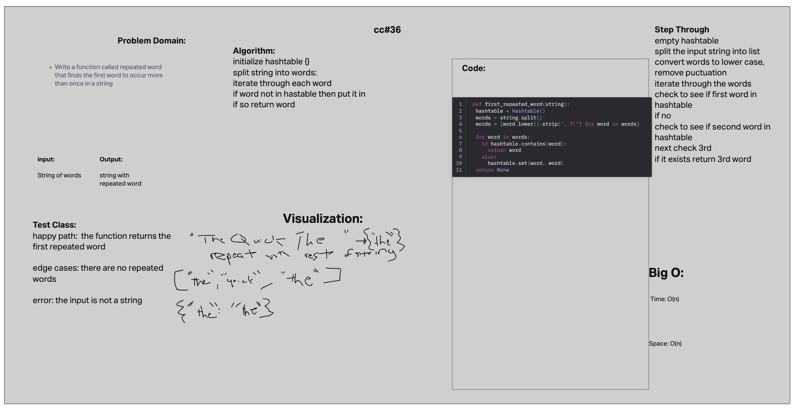

# hashmap-repeated-word

## Challenge 31

Write a function called repeated word that finds the first word to occur more than once in a string
Arguments: string
Return: string

## Collaborators

python 401 class

## Whiteboard Process

## Solution

[hashmap-repeated-word](python/code_challenges/hashtable_repeated_word.py)

