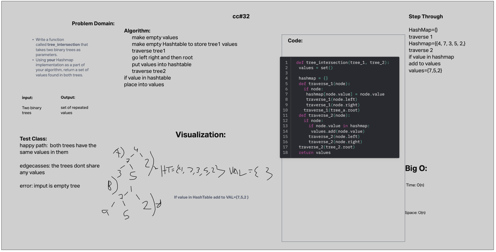

# tree-intersection

## Challenge 32

Write a function called tree_intersection that takes two binary trees as parameters.
Using your Hashmap implementation as a part of your algorithm, return a set of values found in both trees.

## Collaborators

python 401 class

## Whiteboard Process

## Solution

[tree-intersection](python/code_challenges/tree_intersection.py)

## test

[test-tree-intersection](python/tests/code_challenges/test_tree_intersection.py)
