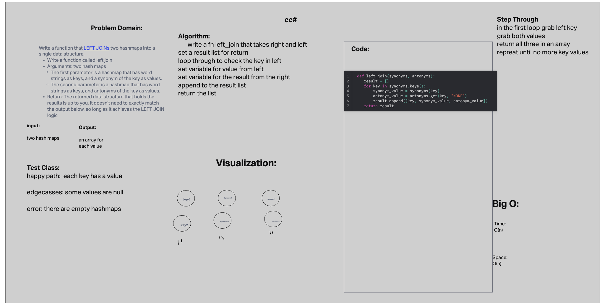

# hashmap-left_jion

## Challenge 33

Write a function called left join
Arguments: two hash maps
The first parameter is a hashmap that has word strings as keys, and a synonym of the key as values.
The second parameter is a hashmap that has word strings as keys, and antonyms of the key as values.
Return: The returned data structure that holds the results is up to you. It doesn’t need to exactly match the output below, so long as it achieves the LEFT JOIN logic

## Collaborators

python 401 class

## Whiteboard Process

## Solution

[hashmap-left-join](python/code_challenges/hashtable_left_join.py)

## test

[hasmap-test](python/tests/code_challenges/test_hashtable_left_join.py)
