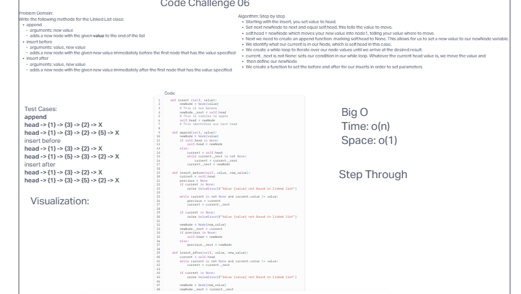

# Challenge 6

Write the following methods for the Linked List class:

append
  arguments: new value
  adds a new node with the given value to the end of the list
insert before
  arguments: value, new value
  adds a new node with the given new value immediately before the first node that has the value specified
insert after
  arguments: value, new value
  adds a new node with the given new value immediately after the first node that has the value specified

## Whiteboard Process

## Approach & Efficiency

We used Bard to get the tests to work. This didn't work everytime but when we put our heads together we were able to figure it out and make it work.

## Solution

class Node:
    def __init__(self, value, _next=None):
        self.value = value
        self._next = _next

class LinkedList:
    """
    Put docstring here
    """
    def __init__(self, head=None, values=None, insert=None):
        self.head = None

    def insert (self, value):
        newNode = Node(value)
        # This is our banana
        newNode._next = self.head
        # This is similar to apple
        self.head = newNode
        # This identifies our next head

    def append(self, value):
        newNode = Node(value)
        if self.head is None:
            self.head = newNode
        else:
            current = self.head
            while current._next is not None:
                current = current._next
            current._next = newNode

    def insert_before(self, value, new_value):
        current = self.head
        previous = None
        if current is None:
            raise ValueError(f"Value {value} not found in linked list")

        while current is not None and current.value != value:
            previous = current
            current = current._next

        if current is None:
            raise ValueError(f"Value {value} not found in linked list")

        newNode = Node(new_value)
        newNode._next = current
        if previous is None:
            self.head = newNode
        else:
            previous._next = newNode

    def insert_after(self, value, new_value):
        current = self.head
        while current is not None and current.value != value:
            current = current._next

        if current is None:
            raise ValueError(f"Value {value} not found in linked list")

        newNode = Node(new_value)
        newNode._next = current._next
        current._next = newNode

    def __str__(self):
      if self.head == None:
        return "NULL"
      else:
        current = self.head
      output = ""
      while current:
        output += f"{{ {current.value} }} -> "
        current = current._next
      output += "NULL"
      return output

    def includes(self, value):
        current = self.head
        while current:
            if current.value == value:
                return True
            current = current._next
        return False

    def traverse(self):
        current = self.head
        while current is not None:
            print(current.value)
            current = current._next

class TargetError:
    pass

