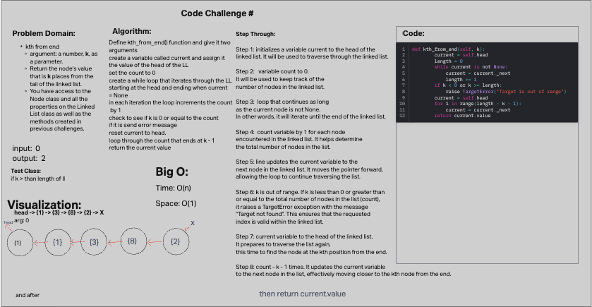

# Challenge 7

Write the following methods for the Linked List class:

kth from end
argument: a number, k, as a parameter.
Return the node’s value that is k places from the tail of the linked list.
You have access to the Node class and all the properties on the Linked List class as well as the methods created in previous challenges.

## Whiteboard Process

## Approach & Efficiency

Time: O(n)
Space: O(1)

## Solution

def kth_from_end(self, k):
        current = self.head
        length = 0
        while current is not None:
            current = current._next
            length += 1
        if k < 0 or k >= length:
            raise TargetError("Target is out of range")
        current = self.head
        for i in range(length - k - 1):
            current = current._next
        return current.value
