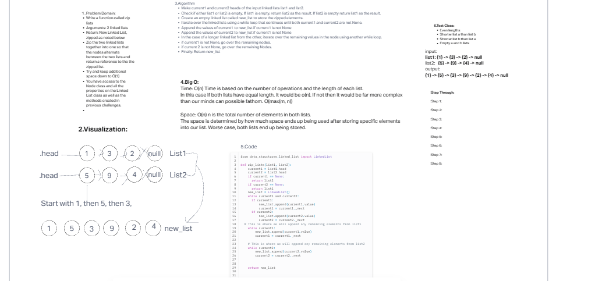

# Challenge 7

Write a function called zip lists
Arguments: 2 linked lists
Return: New Linked List, zipped as noted below
Zip the two linked lists together into one so that the nodes alternate between the two lists and return a reference to the the zipped list.
Try and keep additional space down to O(1)
You have access to the Node class and all the properties on the Linked List class as well as the methods created in previous challenges.

## Whiteboard Process

## Approach & Efficiency

Time: O(n)
Space: O(n)

## Solution

from data_structures.linked_list import LinkedList
<!-- // This is a traversal method for how to iterate through two different linked lists -->
def zip_lists(list1, list2):
    current1 = list1.head
    current2 = list2.head
    if current1 == None:
      return list2
    if current2 == None:
      return list1
    new_list = LinkedList()
    while current1 and current2:
      if current1:
          new_list.append(current1.value)
          current1 = current1._next
      if current2:
          new_list.append(current2.value)
          current2 = current2._next
  <!-- // This is where we will append any remaining elements from list1 -->
    while current1:
        new_list.append(current1.value)
        current1 = current1._next

    # This is where we will append any remaining elements from list2
    while current2:
        new_list.append(current2.value)
        current2 = current2._next

    return new_list
