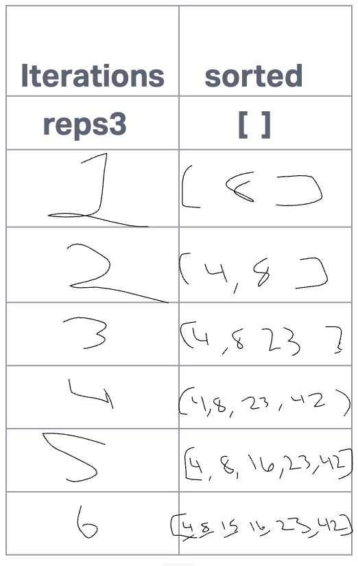

# Blog Notes: Insertion Sort

Here is a reworded version of the provided text:

Begin by initializing an empty array called "sorted" as "sorted=[]". To start the iteration, take the first element of the input array, which is "8". Since "sorted" is empty, add "8" directly to it, resulting in "sorted=[8]".

Move on to the next element, which is "4". Insert "4" into the correct position within "sorted".

Using the Insert function, set "i" to 0, "value" to 4, and "sorted[i]" to 8. Since 4 is less than 8, the first loop stops.

In the second while loop, assign "temp" the value of "sorted[i]", which is 8. Set "sorted[i]" to "value", which is 4. Update "value" to "temp", which is 8. Increment "i". The second loop ends, and append "value" (which is now 8) to "sorted", resulting in "sorted=[4, 8]".

Continue with the next element, which is "23". Insert "23" into "sorted".

Set "i" to 0. Assign "value" as 23 and "sorted[i]" as 4. Since 23 is greater than 4, increment "i" to 1. Update "value" to 23 and "sorted[i]" to 8. Since 23 is greater than 8, increment "i" to 2.

When "i" becomes equal to the length of "sorted" (which is 2), exit the first loop. Append "value" (which is 23) to "sorted", resulting in "sorted=[4, 8, 23]".

Proceed with the next element, which is "42".

Set "i" to 0. Assign "value" as 42 and "sorted[i]" as 4. Since 42 is greater than 4, increment "i" to 1. Update "value" to 42 and "sorted[i]" to 8. Since 42 is greater than 8, increment "i" to 2. Update "value" to 42 and "sorted[i]" to 23. Since 42 is greater than 23, increment "i" to 3.

When "i" becomes equal to the length of "sorted" (which is 3), exit the while loop. Append "value" (which is 42) to "sorted", resulting in "sorted=[4, 8, 23, 42]".

Handle the next element, which is "16".

Set "i" to 0. Assign "value" as 16 and "sorted[i]" as 4. Since 16 is greater than 4, increment "i" to 1. Update "value" to 16 and "sorted[i]" to 8. Since 16 is greater than 8, increment "i" to 2. Stop the while loop since 16 is not greater than 23.

Append "value" (which is 16) to "sorted" at the current position of "i", resulting in "sorted=[4, 8, 16, 23, 42]".

Process the next element, which is "15".

Set "i" to 0. Assign "value" as 15 and "sorted[i]" as 4. Since 15 is greater than 4, increment "i" to 1. Update "value" to 15 and "sorted[i]" to 8. Since 15 is greater than 8, increment "i" to 2. Stop the while loop since 15 is not greater than 16.

Append "value" (which is 15) to "sorted" at the current position of "i", resulting in "sorted=[4, 8, 15, 16, 23, 42]".

The time complexity is O(n^2) due to the nested while loop, and the space complexity is O(1) since the array is sorted in-place.

## testing

pytest sorting/insertion/test_insertion.py

## Attribution

Google BARD
